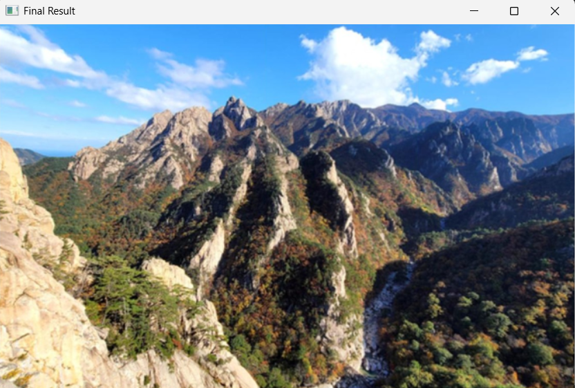

# Image Stitching using OpenCV

이 프로젝트는 OpenCV를 사용하여 여러 장의 이미지를 하나의 넓은 이미지로 합치는 이미지 스티칭 구현입니다.

## 프로젝트 설명

BRISK(Binary Robust Invariant Scalable Keypoints) 특징 탐지기를 사용하여 인접한 이미지들의 특징점을 찾고 매칭한 후, 호모그래피(Homography)를 계산하여 이미지들을 정렬 및 합성합니다.

## 주요 기능

- **이미지 전처리**: 모든 이미지를 동일한 높이로 조정합니다.
- **특징점 탐지**: BRISK 알고리즘으로 특징점 검출합니다.
- **특징 매칭**: Brute Force 매칭을 사용하여 특징점 대응합니다.
- **호모그래피 계산**: RANSAC을 사용한 강건한 호모그래피 추정합니다.
- **이미지 합성**: Perspective Transform으로 이미지 정렬 및 합성합니다.

## 코드 구조

### `preprocess_image(img, target_height)`
- 이미지의 높이를 지정된 높이로 조정합니다.
- 비율을 유지하며 리사이징합니다.

### `stitch_with_roi(base_img, next_img)`
- 두 개의 이미지를 합칩니다.
- ROI(Region of Interest)를 사용하여 특징점을 탐지합니다.
- 호모그래피를 계산하고 이미지를 변환합니다.

## 알고리즘 개요

1. **특징점 탐지**: Base 이미지의 오른쪽 절반에서 특징점 탐지
2. **특징 설명자 추출**: 각 이미지에서 특징 설명자 추출
3. **특징 매칭**: 두 이미지 간의 특징점 매칭
4. **거리 기준으로 정렬**: 매칭된 점들을 거리 순서로 정렬
5. **호모그래피 계산**: RANSAC 방법으로 강건한 호모그래피 계산
6. **이미지 변환**: Perspective Transform으로 이미지 정렬
7. **합성**: 변환된 이미지와 base 이미지 합성

## 결과
최종 결과는 세 개의 이미지가 하나로 합쳐진 넓은 파노라마 이미지입니다.

